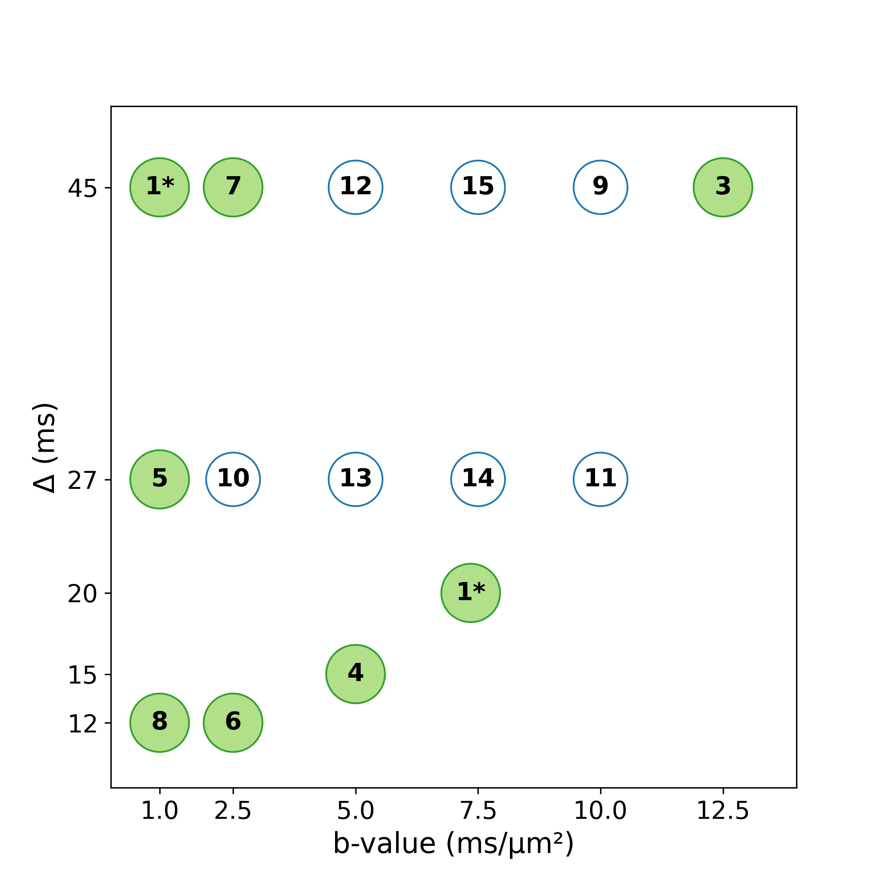
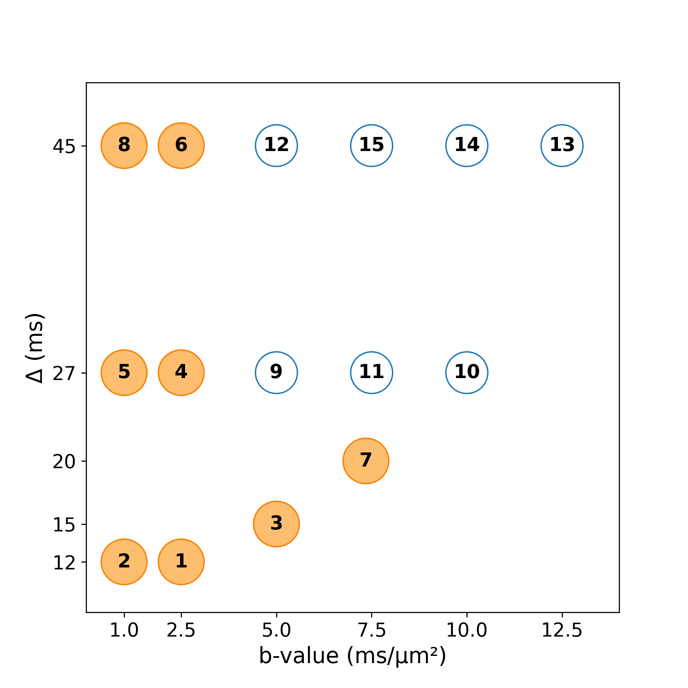

# XAI-dMRI-protocol-optimization

This repository contains all code used in the paper:

> **"Reduced NEXI protocol for the quantification of human gray matter microstructure on the CONNECTOM 2.0 scanner"**  
> Quentin Uhl, Tommaso Pavan, Julianna Gerold, Kwok-Shing Chan, Yohan Jun, Shohei Fujita, Aneri Bhatt, Yixin Ma, Qiaochu Wang, Hong-Hsi Lee, Susie Y. Huang, Berkin Bilgic\*, Ileana Jelescu\*  
> _\*Joint last authorship_  
>  
> [Arxiv link](https://github.com/QuentinUhl/XAI-dMRI-protocol-optimization) (to be updated)

---

## 📌 Overview

This work introduces a **data-driven framework** for optimizing NEXI (Neurite Exchange Imaging) protocols using **explainable machine learning** (XAI) to reduce scan time without compromising accuracy.

We propose and validate two complementary strategies:

- ✅ **SHAP-RFE optimization** using XGBoost regression, recursive feature elimination, and SHAP values.
- ✅ **FIM-based optimization** using the determinant of the Fisher Information Matrix (D-optimality) for protocol reduction.

From an initial 15-feature ($b$, $\Delta$) protocol, we derived an optimal 8-feature subset. This reduced protocol cuts scan time by nearly **50%**, while retaining estimation accuracy, anatomical contrast, and test-retest reliability across all NEXI parameters ($t_{ex}$, $f$, $D_i$, $D_e$).

---

## 📂 Repository structure

```bash
XAI-dMRI-protocol-optimization/
├── fim_optimization.py          # Fisher Information Matrix-based protocol reduction
├── xai_optimization.py         # SHAP-RFE-based protocol optimization using XGBoost
├── C2_complex_all_sigma.npz     # Empirical distribution of noise levels (sigma)
├── C2_complex_fim_optimization.png   # Visualization of FIM-reduced protocol
├── C2_complex_xgb_optimization.png   # Visualization of SHAP-reduced protocol
├── requirements.txt             # Python dependencies
├── README.md                    # This file
└── LICENSE                      # Apache 2.0 License
```

## 📈 Output visualizations

Both optimization pipelines generate summary visualizations showing the retained features (acquisition points) and their ranking.

| XAI / SHAP-RFE (data-driven)                          | FIM (theory-driven)                           |
|--------------------------------------------------|-----------------------------------------------|
| Produced by: `xai_optimization.py`              | Produced by: `fim_optimization.py`            |
|        |       |

These images show the selected ($b$, $\Delta$) points (green circles) ranked by importance. The SHAP-based optimization integrates fitting performance and noise robustness, while the FIM method uses D-optimality to assess theoretical identifiability.


## Citation

If you use this package in your research, please consider citing the following papers:

### Arxiv link to be released soon

### Development of the graymatter_swissknife used in this package
Quentin Uhl, Tommaso Pavan, Thorsten Feiweier, Gian Franco Piredda and Ileana Jelescu, [Human gray matter microstructure mapped using neurite exchange imaging (NEXI) on a clinical scanner](https://direct.mit.edu/imag/article/doi/10.1162/IMAG.a.32/130941/Human-gray-matter-microstructure-mapped-using), Imaging Neuroscience, 2025

## License

This repository is distributed under the terms of the [Apache License 2.0](https://spdx.org/licenses/Apache-2.0.html).
